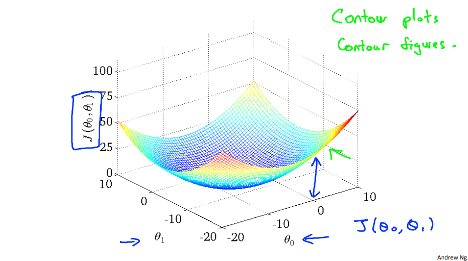

*이 글은 Coursera에서 Andrew Ng 교수님의 머신러닝 강의를 듣고 읽기 자료를 읽으면서 복습차원에서 개인적으로 요약한 글입니다.*

# 변수 1개에 대한 선형 회귀 - Model and Cost Function

## 모델의 표현
- $m$ : 훈련 데이터의 개수
- $x$ : 입력 데이터/입력 특성
- $y$ : 출력 데이터/타겟
- $h$ : ($x$, $y$)을 통해 학습된 가설
  
($x$, $y$)를 하나의 훈련 데이터 세트로 보면 됨.\
($x^{(i)}$, $y^{(i)}$) : i번째 훈련 데이터

추상화 모델

</img>\
훈련 세트로 학습 알고리즘을 통해 가설을 정하고 입력값을 가설에 넣어서 출력값을 예측한다.

### Example

집의 크기를 통해 1000피트 당 가격을 예측하는 회귀 문제

훈련 세트
|집의 크기($feet^2$)|1000$feet^2$ 당 가격|
|:----:|:----:|
|2104|460|
|1416|232|
|1534|315|
|852|178|
|...|...|

가설 세우기 : 집의 크기가 커질수록 가격이 증가하므로 간단한 선형 회귀로 가설을 세울 수 있다.\

강의자료처럼 $\theta_0$과 $\theta_1$을 계수로 갖는 일차함수로 모델의 가설을 세울 수 있다.\
가설 식 : $h_{(\theta)}(x)=\theta_0+\theta_1x$

## 비용 함수
가설 식의 $\theta_i$를 파라미터라 하며 선형 회귀 문제는 예측을 잘 하는 파라미터를 선택하는 것이다.\
파라미터를 구하기 위해서 모델 가설이 얼마나 잘 예측하는지 성능을 측정할 수 있는 도구가 필요하며 그것이 비용 함수(Cost Function)이다.\
선형 회귀에서는 MSE(Mean Squared Error)를 사용한다. 즉 예측값과 실제값의 차이의 제곱의 평균을 사용한다. 따라서 비용함수는 다음과 같다.

비용함수 : $J(\theta_0, \theta_1)={1\over2m}\sum_{i=1}^m (h_{(\theta)}(x^{(i)})-y^{(i)})^2$ 

(가설 및 변수는 위에서 정의한 것과 동일)\
평균인데 $2m$으로 나누는 이유는 미분 시 편리성을 위함이다.

## 비용 함수 최소화하기
$J$의 값을 최소화할수록 모델의 예측 성능이 올라가므로 $J$의 값을 최소화하는 $\theta_0$, $\theta_1$을 찾아야 한다.\
$J$는 $\theta_0$, $\theta_1$에 대한 이차식이므로 $\theta_0$, $\theta_1$을 $x$, $y$축으로 하고 $J$를 $z$축으로 하는 3차원 그래프를 그리면 강의자료의 그래프처럼 나온다.\

즉 $\theta_0$, $\theta_1$을 그래프의 오목한 쪽으로 이동시켜 $J$를 최소로 만들어야 한다.

아래 그림은 강의에서 직접 $\theta_0$, $\theta_1$의 값을 등고선의 오목한 부분으로 이동시키면서 가설의 그래프의 변동을 확인하는 모습이다.\

$J$가 최소인 지점으로 이동할수록 가설 그래프가 학습 데이터 포인트와 점차 유사하게 그려짐을 확인할 수 있다.
