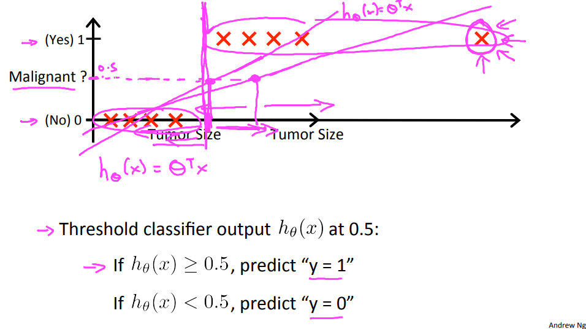
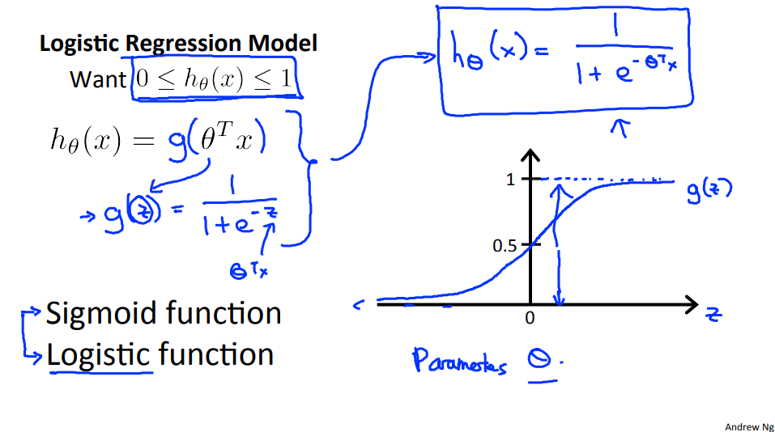
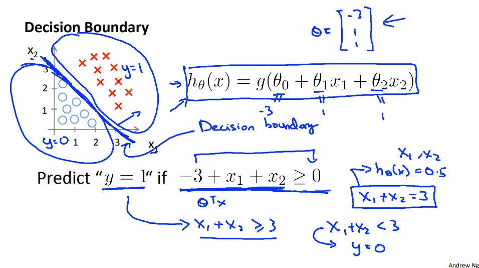

*이 글은 Coursera에서 Andrew Ng 교수님의 머신러닝 강의를 듣고 읽기 자료를 읽으면서 복습차원에서 개인적으로 요약한 글입니다.*

# 로지스틱 회귀 - Classification and Representation

## 분류(Classification) 문제
이제까지 강의에서 배운 회귀 문제는 결과값이 연속적인 값으로 나타내어졌지만 분류 문제는 결과값이 말 그대로 여러 개의 class, 즉 불연속적인 값으로 나뉘어진다. 

예를 들어 이메일이 스팸인가/아닌가, 종양이 양성인가/음성인가 등의 문제가 분류 문제가 된다. 강의에서는 먼저 클래스가 두 개인 분류 문제를 다룬다. 즉 데이터 파일에서 y가 0, 1인 경우만을 먼저 다룬다. 

예를 들어 종양이 양성인가/음성인가 다루는 문제를 보면 강의 자료에서는 다음과 같은 그림으로 설명한다.\
\
종양의 크기로 양성/음성을 판단하며 종양이 양성이면 1, 음성이면 0인데 일반적인 선형 회귀로 이를 해결한다고 하면 선형 회귀 함수로 도출한 값 $h_\theta(x)$가 0.5보다 크거나 같으면 양성(1), 작으면 음성(0)으로 판단할 수 있다. 그러나 여기에는 문제점이 하나 있는데 위 강의 자료의 그래프처럼 데이터가 기존 데이터 군집과 멀리 떨어져 있으면 $h_\theta(x)$를 데이터에 적합하게 그리기가 어려워진다. 따라서 데이터에 더 적합한 함수가 필요하다.

이진 분류 문제에서는 이를 확률적인 측면으로 접근한다. 회귀를 수행하여 도출한 값은 0~1 사이의 값이고 $0.5\le h_\theta(x)\le 1$이면 1, $0\le h_\theta(x)<0.5$이면 0으로 판단한다. 이러한 회귀 방법을 로지스틱 회귀(Logistic Regression)라고 한다.

## 가설의 표현
앞에서 언급했듯이 로지스틱 회귀를 통해 도출한 값은 $0\le h_\theta(x)\le 1$이여야 한다. 이 범위를 맞추기 위해 시그모이드(Sigmoid) 함수를 도입한다. 시그모이드 함수는 다음과 같다.

$g(z)={1\over 1+e^{-z}}$

시그모이드 함수의 그래프는 다음과 같다.\

z에는 기존 회귀 함수의 행렬 표현식인 $\theta^TX$를 대입하여 회귀의 도출 값을  $0\le h_\theta(x)\le 1$ 범위로 한정할 수 있다. 즉 다음 식이 로지스틱 회귀 함수 식이 된다.

$h_\theta(x)=g(\theta^TX)={1\over 1+e^{-\theta^TX}}$

이제 로지스틱 회귀를 종양 문제에 대입해 보면 먼저 종양의 크기를 특성 $x_1$로 하고 $\theta_0$ 처리를 위해 $x_0(=1)$을 추가하여 입력 데이터 벡터 $x$를 만들 수 있다.

$x=\begin{bmatrix}x_0\\x_1\end{bmatrix}$

해당 입력 벡터를 입력으로 받으면 로지스틱 회귀 함수는 출력값으로 0~1 사이의 확률값 y를 도출한다. 즉 확률식으로 표현하면 입력 벡터 $x$와 계수 벡터 $\theta$일 때 $y=1$일 조건확률식이 된다.

$h_\theta(x)=P(y=1|x;\theta)$

즉 $y=0$일 확률은 1에서 $y=1$일 확률을 뺀 것과 같다.

$P(y=0|x;\theta) = 1-P(y=1|x;\theta)=1-h_\theta(x)$

## 결정 경계(Decision Boundary)
앞에서 언급한 것처럼 $0.5\le h_\theta(x)\le 1$이면 1, $0\le h_\theta(x)<0.5$이면 0으로 판단한다. 0.5가 경계값인 셈인데 시그모이드 함수에서 $z=0$일 때 값이 0.5가 나온다. 즉 $\theta^TX\ge 0$이면 로지스틱 회귀 값이 0.5보다 크거나 같고 $\theta^TX\le 0$이면 로지스틱 회귀 값이 0.5보다 작다. 그럼 이 $\theta^TX$의 의미는 무엇일까 생각해 볼 수 있다.

강의 자료에서는 특성 $x_1$, $x_2$를 가진 데이터에 대한 로지스틱 회귀를 두 가지 예시를 들어서 설명하고 있다.\
\
위의 경우 데이터가 직선 함수로 완벽하게 나누어진다. 즉 $\theta^TX$의 식이 다음과 같은 일차함수 식이다.

$\theta^TX=\theta_0+\theta_1x_1+\theta_2x_2$

따라서 위의 식이 0보다 크거나 같으면 1로 예측하고, 0보다 작으면 0으로 예측하게 된다. 저 직선 함수가 결정 경계가 되는 셈이다.

\
위의 경우는 직선 경계로는 데이터를 나눌 수 없지만 정확히 원의 방정식으로 경계를 세울 수 있다. 따라서 기존의 특성 두 개에 다항식 회귀를 적용하여 $x_1^2$, $x_2^2$을 기존의 $x$ 벡터에 추가하게 된다. 따라서 데이터 행렬 $X$도 그에 맞게 바뀌고 $\theta$ 벡터에도 추가한 특성들에 대한 계수($\theta_3$, $\theta_4$)를 추가해야 한다. $\theta^TX$의 식은 다음과 같은 원의 방정식이 된다.

$\theta^TX=\theta_0+\theta_1x_1+\theta_2x_2+\theta_3x_1^2+\theta_4x_2^2$

따라서 위의 식이 0보다 크거나 같으면 입력 데이터가 원의 바깥 영역부터 원의 경계에 위치하며 이를 1로 판단하고 0보다 작으면 입력 데이터가 원의 안쪽 영역에 위치하며 이를 0으로 판단한다.

결정 경계선이 더 복잡해지면 위 강의에 나온 식처럼 더 많은 고차항을 추가하여 다항식 회귀를 할 수도 있다. 
