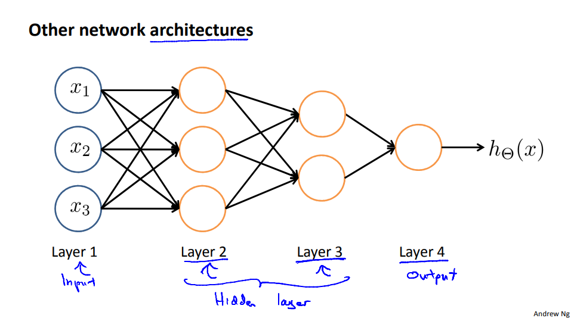

*이 글은 Coursera에서 Andrew Ng 교수님의 머신러닝 강의를 듣고 읽기 자료를 읽으면서 복습차원에서 개인적으로 요약한 글입니다.*

# 인공신경망 - Model Representation

## 비선형 가설의 접근
로지스틱 회귀에서 기존 특성의 거듭제곱항을 추가함으로써 결정 경계를 비선형으로도 그릴 수 있다. 이를테면 강의자료의 다음 그림과 같다.

기존 특성이 100개라고 하면 여기서 다항식 회귀를 할때 차수 제한을 최대 2로 두게 되면 약 5000개의 특성으로 늘어난다. 시간복잡도는 $n=100$일 때 $O(n^2)$이다. 만약 차수 제한을 최대 3으로 두게 되면 특성은 약 170000개까지 늘어난다. 시간복잡도는 $O(n^3)$이다. 즉 차수가 늘어날수록 항의 개수는 급격하게 늘어나며 계산량 또한 급격하게 증가한다. 또한 존재하는 모든 다차항을 사용하게 되면 과적합의 문제가 발생할 수 있으므로 사용하고 싶은 다차항을 고르는 것도 문제이다.

위의 예시는 기존 특성이 100개이지만 컴퓨터 비전 분야에서의 이미지 처리를 생각해 볼 수도 있다. 아래 그림에서 차 사진이 (50, 50) 픽셀이면 총 2500개의 픽셀이 나오고 이는 특성이 2500개라는 뜻이다. 만약에 이미지가 RGB 이미지라면 3배인 7500개 픽셀도 등장할 수 있다. 이 경우 다항식을 이용한 로지스틱 회귀를 진행한다면 최대 차수가 2일 시 총 항의 개수가 3백만 개도 나올 수 있다. 이는 매우 많은 양임을 알 수 있다.

## 인공신경망(Neural Network) 모델
사람의 뇌를 모방해서 인공지능을 만드려는 시도는 80년대부터 진행되었다. 간단히 말해서 사람의 뇌는 엄청난 수의 뉴런으로 이루어져 있고 이 뉴런의 구조는 아래 그림과 같다.

간단하게 말해서 입력 돌기가 있고 이를 어떤 방식으로 처리하여 출력 돌기로 내보는 구조이다. 이 출력 돌기는 다른 뉴런의 입력 돌기로 들어갈 수 있다. 이런 식으로 여러 개의 뉴런을 거쳐서 출력 돌기로 나오면 이 정보는 근육 등으로 전달되어 출력 결과(행동)로 이어진다.

인공지능을 연구하는 학자들은 이 하나의 뉴런을 모방해서 로지스틱 유닛, 혹은 퍼셉트론이라는 하나의 단위 모델로 만들어내었다. 아래 강의 자료 그림을 보면 그 모델을 대략적으로 파악할 수 있다.

입력값은 기존의 입력 벡터와 동일하며 상수항 $\theta_0$ 처리를 위해 $x_0=1$ 값이 따로 존재한다. 이를 Bias Unit이라고 하며 모델에서 나타내기도 하고 생략하기도 한다. 특성이 n개이면 $\theta$ 벡터는 기존 회귀처럼 $(n+1)$ 차원의 벡터이다. 이를 가중치(Weight) 또는 파라미터라고 한다. 주황색 원 위치에서는 기존 회귀에서 가중치 벡터와 입력 벡터를 곱하고 시그모이드 함수를 적용하며 식은 $g(\theta x)$가 된다. 시그모이드 함수를 활성화 함수(Activation Function)라고 부른다. 이렇게 해서 로지스틱 유닛 하나에서 나오는 가설 $h_\theta(x)$는 기존 로지스틱 회귀의 가설과 동일하다. 

이 로지스틱 모델을 여러 개 연결함으로써 인공신경망을 구축할 수 있다. 강의에서는 층이 네 개인 인공신경망을 보여 준다.

그림의 모델은 입력 유닛이 3개(bias unit까지 4개)이며 중간에 두 개의 층이 존재한다. 이를 은닉층(Hidden Layer)이라고 한다. 첫 번째 은닉 층은 결과 유닛이 세 개이다. 즉 입력 층에 대하여 결과가 세 개가 존재한다. 두 번째 은닉 층에서는 이전의 결과 유닛 세 개를 입력 유닛(bias unit 추가)으로 받고 결과 유닛 하나를 출력한다. 이것이 이 모델의 결과가 된다.

그림에서 정의한 notation을 이용해 각 유닛에서의 계산식을 정리할 수 있다. $\theta$ 벡터는 결과 유닛 하나당 하나씩 존재해야 하므로 첫 번째 은닉 층에서의 $\theta$ 벡터는 3개가 필요하다. $\theta$ 벡터의 크기는 입력 유닛이 3개이므로 bias unit을 고려하여 4차원 벡터가 된다. $\theta_{xy}^{(j)}$를 층 j에서 x번째 결과 유닛에 사용되는 $\theta$ 벡터 중 y번째 원소라고 하고 $a_i^{j}$를 층 j에서 활성화된 i번째 결과 유닛이라고 하면 각 결과 유닛에 대한 식은 다음과 같이 정리된다.

층 2:\
$a_1^{(2)}=g(\theta_{10}^{(1)}x_0+\theta_{11}^{(1)}x_1+\theta_{12}^{(1)}x_2+\theta_{13}^{(1)}x_3)$\
$a_2^{(2)}=g(\theta_{20}^{(1)}x_0+\theta_{21}^{(1)}x_1+\theta_{22}^{(1)}x_2+\theta_{23}^{(1)}x_3)$\
$a_3^{(2)}=g(\theta_{30}^{(1)}x_0+\theta_{31}^{(1)}x_1+\theta_{32}^{(1)}x_2+\theta_{33}^{(1)}x_3)$

층 3:\
$a_1^{(3)}=g(\theta_{10}^{(2)}a_0^{(2)}+\theta_{11}^{(2)}a_1^{(2)}+\theta_{12}^{(2)}a_2^{(2)}+\theta_{13}^{(2)}a_3^{(2)})$

층 2, 3에서 각각 bias unit $x_0$, $a_0^{(2)}$가 추가되는 것을 주의해야 한다.

결국 출력은 다음과 같다.

$h_\theta(x)=g(\theta_{10}^{(2)}a_0^{(2)}+\theta_{11}^{(2)}a_1^{(2)}+\theta_{12}^{(2)}a_2^{(2)}+\theta_{13}^{(2)}a_3^{(2)})$

신경망의 로지스틱 유닛들도 벡터화 식으로 표현이 가능하다. $x$를 입력 벡터, $z^{(2)}$를 층 1에서 가중치를 적용한 값, $z^{(3)}$을 층 2에서 가중치를 적용한 값, $\theta^{(1)}$을 층 1에서 2 사이의 가중치 행렬,  $\theta^{(2)}$를 층 2에서 3 사이의 가중치 행렬이라고 하면 위 신경망 모델에 대하여

$x=\begin{bmatrix}x_0\\x_1\\x_2\\x_3\end{bmatrix}, \theta^{(1)}=\begin{bmatrix}\theta_{10}^{(1)}&\theta_{11}^{(1)}&\theta_{12}^{(1)}&\theta_{13}^{(1)}\\\theta_{20}^{(1)}&\theta_{21}^{(1)}&\theta_{22}^{(1)}&\theta_{23}^{(1)}\\\theta_{30}^{(1)}&\theta_{31}^{(1)}&\theta_{32}^{(1)}&\theta_{33}^{(1)}\end{bmatrix}$

$z^{(2)}=\begin{bmatrix}z_1^{(2)}\\z_2^{(2)}\\z_3^{(2)}\end{bmatrix}, \theta^{(2)}=\begin{bmatrix}\theta_{0}^{(2)}&\theta_{1}^{(2)}&\theta_{2}^{(2)}&\theta_{3}^{(2)}\\\end{bmatrix}$

이렇게 행렬로 표현할 수 있다. 각 변수들을 행렬 식의 곱으로 나타내면 신경망 모델의 포워딩은 다음과 같이 진행된다.

먼저 층 1~2의 가중치를 입력 벡터에 적용하고 활성화함수 $g$를 적용하여 층 2의 출력 유닛 $a^{(2)}$를 완성한다. 

$z^{(2)}=\theta^{(1)}x$

$a^{(2)}=g(z^{(2)})$

다음으로 $a^{(2)}$에 bias unit $a_0^{(2)}=1$을 추가한 후 층 2~3의 가중치를 $a^{(2)}$에 적용하고 활성화함수 $g$를 적용하여 층 3의 출력 유닛 $a^{(3)}$를 완성하면 이것이 신경망 모델의 출력값 $h_\theta(x)$가 된다.

$z^{(3)}=\theta^{(2)}a^{(2)}$

$h_\theta(x)=a^{(3)}=g(z^{(3)})$

이 신경망을 학습시킨다는 것은 모델의 모든 층의 가중치들을 학습시킨다는 의미이다. 

신경망의 각 층에는 이름이 있다. 강의의 다음 신경망으로 예시로 보면 해당 신경망을 층이 4개이다.

입력 유닛이 위치하는 층 1을 입력 계층(Input Layer), 마지막으로 출력유닛이 나오는 층 4를 출력 계층(Output Layer), 그 외의 중간 층들은 모두 은닉 계층(Hidden Layer)라고 한다. 

